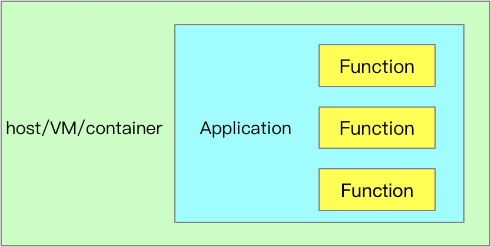
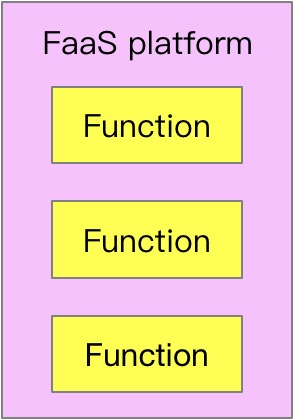
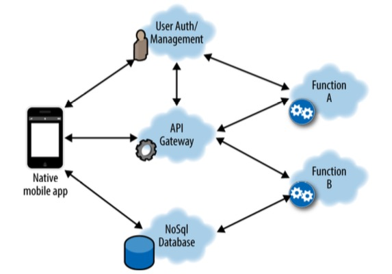

# 理解Serverless

No silver bullet. - The Mythical Man-Month

许多年前，我们开发的软件还是C/S（客户端/服务器）和MVC（模型-试图-控制器）的形式，再后来有了SOA，最近几年又出现了微服务架构，更新一点的有Cloud Native（云原生）应用，企业应用从单体架构，到服务化，再到更细粒度的微服务化，应用开发之初就是为了应对互联网的特有的高并发、不间断的特性，需要很高的性能和可扩展性，人们对软件开发的追求孜孜不倦，希望力求在软件开发的复杂度和效率之间达到一个平衡。但可惜的是，NO SILVER BULLET！几十年前（1975年）Fred Brooks就在The Mythical Man-Month中就写到了这句话。那么Serverlss会是那颗银弹吗？

云改变了我们对操作系统的认知，原来一个系统的计算资源、存储和网络是可以分离配置的，而且还可以弹性扩展，但是长久以来，我们在开发应用时始终没有摆脱的服务器的束缚（或者说认知），应用必须运行在不论是实体还是虚拟的服务器上，必须经过部署、配置、初始化才可以运行，还需要对服务器和应用进行监控和管理，还需要保证数据的安全性，这些云能够帮我们简化吗？**让我们只要关注自己代码的逻辑就好了，其它的东西让云帮我实现就好了。**

## Serverless介绍

Serverless架构是云的自然延伸，为了理解serverless，我们有必要回顾一下云计算的发展。

### IaaS

2006年AWS推出EC2（Elastic Compute Cloud），作为第一代IaaS（Infrastructure as a Service），用户可以通过AWS快速的申请到计算资源，并在上面部署自己的互联网服务。IaaS从本质上讲是服务器租赁并提供基础设施外包服务。就比如我们用的水和电一样，我们不会自己去引入自来水和发电，而是直接从自来水公司和电网公司购入，并根据实际使用付费。

EC2真正对IT的改变是硬件的虚拟化（更细粒度的虚拟化），而EC2给用户带来了以下五个好处：

- 降低劳动力成本：减少了企业本身雇佣IT人员的成本
- 降低风险：不用再像自己运维物理机那样，担心各种意外风险，EC2有主机损坏，再申请一个就好了。
- 降低基础设施成本：可以按小时、周、月或者年为周期租用EC2。
- 扩展性：不必过早的预期基础设施采购，因为通过云厂商可以很快的获取。
- 节约时间成本：快速的获取资源开展业务实验。

以上说了是IaaS或者说基础设施外包的好处，当然其中也有弊端，我们将在后面讨论。

以上是AWS为代表的公有云IaaS，还有使用[OpenStack](https://www.openstack.org/)构建的私有云也能够提供IaaS能力。

### PaaS

PaaS（Platform as a Service）是构建在IaaS之上的一种平台服务，提供操作系统安装、监控和服务发现等功能，用户只需要部署自己的应用即可，最早的一代是Heroku。Heroko是商业的PaaS，还有一个开源的PaaS——[Cloud Foundry](https://www.cloudfoundry.org/)，用户可以基于它来构建私有PaaS，如果同时使用公有云和私有云，如果能在两者之间构建一个统一的PaaS，那就是“混合云”了。

在PaaS上最广泛使用的技术就要数[docker](https://www.docker.com/)了，因为使用容器可以很清晰的描述应用程序，并保证环境一致性。管理云上的容器，可以称为是CaaS（Container as a Service），如[GCE（Google Container Engine）](https://cloud.google.com/container-engine/)。也可以基于[Kubernetes](https://kubernetes.io)、[Mesos](http://mesos.apache.org/)这类开源软件构件自己的CaaS，不论是直接在IaaS构建还是基于PaaS。

PaaS是对软件的一个更高的抽象层次，已经接触到应用程序的运行环境本身，可以由开发者自定义，而不必接触更底层的操作系统。

## Serverless的定义

Serverless不如IaaS和PaaS那么好理解，因为它通常包含了两个领域BaaS（Backend as a Service）和FaaS（Function as a Service）。

### BaaS

BaaS（Backend as a Service）后端即服务，一般是一个个的API调用后端或别人已经实现好的程序逻辑，比如身份验证服务Auth0，这些BaaS通常会用来管理数据，还有很多公有云上提供的我们常用的开源软件的商用服务，比如亚马逊的RDS可以替代我们自己部署的MySQL，还有各种其它数据库和存储服务。

### FaaS

FaaS（Functions as a Service）函数即服务，FaaS是无服务器计算的额一种形式，当前使用最广泛的是AWS的Lambada。

现在当大家讨论Serverless的时候首先想到的就是FaaS，有点甚嚣尘上了。FaaS本质上是一种事件驱动的由消息触发的服务，FaaS供应商一般会集成各种同步和异步的事件源，通过订阅这些事件源，可以突发或者定期的触发函数运行。

传统的服务器端软件不同是经应用程序部署到拥有操作系统的虚拟机或者容器中，一般需要长时间驻留在操作系统中运行，而FaaS是直接将程序部署上到平台上即可，当有事件到来时触发执行，执行完了就可以卸载掉。

### 总结

两者都为我们的计算资源提供了弹性的保障，BaaS其实依然是服务外包，而FaaS使我们更加关注应用程序的逻辑，两者使我们不需要关注应用程序所在的服务器，但实际上服务器依然是客观存在的。

当我们将应用程序迁移到容器和虚拟机中时，其实对于应用程序本身的体系结构并没有多少改变，只不过有些流程和规定需要遵守，比如12因素应用守则，但是serverlss对应用程序的体系结构来说就是一次颠覆了，通常我们需要考虑事件驱动模型，更加细化的不熟形式，以及在FaaS组件之外保持状态的需求。

## Serverless应用

我们以一个游戏应用为例，来说明什么是serverless应用。

一款移动端游戏至少包含如下几个特性：

- 移动端友好的用户体验
- 用户管理和权限认证
- 关卡、升级等游戏逻辑，游戏排行，玩家的等级、任务等信息

传统的应用程序架构可能是这样的：

- 一个app前端，iOS后者安卓
- 用Java写的后端，使用JBoss或者Tomcat做server运行
- 使用关系型数据库存储用户数据，如MySQL

这样的架构可以让前端十分轻便，不需要做什么应用逻辑，只是负责渲染用户界面，将请求通过HTTP发送给后端，而所有的数据操作都是有由后端的Java程序来完成的。

这样的架构开发起来比较容易，但是维护起来确十分复杂，前端开发、后端的开发都需要十分专业的人员、环境的配置，还要有人专门维护数据库、应用的更新和升级。

而在serverless架构中，我们不再需要在服务器端代码中存储任何会话状态，而是直接将它们存储在NoSQL中，这样将使应用程序无状态，有助于弹性扩展。前端可以直接利用BaaS而减少后端的编码需求，这样架构的本质上是减少了应用程序开发的人力成本，降低了自己维护基础设施的风险，而且利用云的能力更便于扩展和快速迭代。

## Serverless的优势

在最前面我们提到了使用IaaS给我们带来了五点好处，FaaS当然也包括了这些好处，但是它给我们带来的最大的好处就是**多快好省**。减少从概念原型到实施的等待时间，比自己维护服务更省钱。

**降低人力成本**

不需要再自己维护服务器，操心服务器的各种性能指标和资源利用率，而是关心应用程序本身的状态和逻辑。而且serverless应用本身的部署也十分容易，我们只要上传基本的代码但愿，例如Javascript或Python的源代码的zip文件，以及基于JVM的语言的纯JAR文件。不需使用Puppet、Chef、Ansible或Docker来进行配置管理，降低了运维成本。同时，对于运维来说，也不再需要监控那些更底层的如磁盘使用量、CPU使用率等底层和长期的指标信息，而是监控应用程序本身的度量，这将更加直观和有效。

在此看来有人可能会提出“NoOps”的说法，其实这是不存在的，只要有应用存在的一天就会有Ops，只是人员的角色会有所转变，部署将变得更加自动化，监控将更加面向应用程序本身，更底层的运维依然需要专业的人员去做。

**降低风险**

对于组件越多越复杂的系统，出故障的风险就越大。我们使用BaaS或FaaS将它们外包出去，让专业人员来处理这些故障，有时候比我们自己来修复更可靠，利用专业人员的知识来降低停机的风险，缩短故障修复的时间，让我们的系统稳定性更高。

**减少资源开销**

我们在申请主机资源一般会评估一个峰值最大开销来申请资源，往往导致过度的配置，这意味着即使在主机闲置的状态下也要始终支付峰值容量的开销。对于某些应用来说这是不得已的做法，比如数据库这种很难扩展的应用，而对于普通应用这就显得不太合理了，虽然我们都觉得即使浪费了资源也比当峰值到来时应用程序因为资源不足而挂掉好。

解决这个问题最好的办法就是，不计划到底需要使用多少资源，而是根据实际需要来请求资源，当然前提必须是整个资源池是充足的（公有云显然更适合）。根据使用时间来付费，根据每次申请的计算资源来付费，让计费的粒度更小，将更有利于降低资源的开销。这是对应用程序本身的优化，例如让每次请求耗时更短，让每次消耗的资源更少将能够显著节省成本。

**增加缩放的灵活性**

以AWS Lamba为例，当平台接收到第一个触发函数的事件时，它将启动一个容器来运行你的代码。如果此时收到了新的事件，而第一个容器仍在处理上一个事件，平台将启动第二个代码实例来处理第二个事件。AWS lambad的这种自动的零管理水平缩放，将持续到有足够的代码实例来处理所有的工作负载。

但是，AWS仍然只会向您收取代码的执行时间，无论它需要启动多少个容器实例要满足你的负载请求。例如，假设所有事件的总执行时间是相同的，在一个容器中按顺序调用Lambda 100次与在100个不同容器中同时调用100次Lambda的成本是 一样的。当然AWS Lambada也不会无限制的扩展实例个数，如果有人对你发起了DDos攻击怎么办，那么不就会产生高昂的成本吗？AWS是有默认限制的，默认执行Lambada函数最大并发数是1000。

**缩短创新周期**

小团队的开发人员正可以在几天之内从头开始开发应用程序并部署到生产。使用短而简单的函数和事件来粘合强大的驱动数据存储和服务的API。完成的应用程序具有高度可用性和可扩展性，利用率高，成本低，部署速度快。

以docker为代表的容器技术仅仅是缩短了应用程序的迭代周期，而serverless技术是直接缩短了创新周期，从概念到最小可行性部署的时间，让初级开发人员也能在很短的时间内完成以前通常要经验丰富的工程师才能完成的项目。

## Serverless的劣势

我们知道没有十全十美的技术，在说了serverless的那么多优势之后，我们再来探讨以下serverless的劣势，或者说局限性和适用场景。

**状态管理**

要想实现自由的缩放，无状态是必须的，而对于有状态的服务，使用serverless这就丧失了灵活性，有状态服务需要与存储交互就不可避免的增加了延迟和复杂性。

**延迟**

应用程序中不同组件的访问延迟是一个大问题，我们可以通过使用专有的网络协议、RPC调用、数据格式来优化，或者是将实例放在同一个机架内或同一个主机实例上来优化以减少延迟。

而serverless应用程序是高度分布式、低耦合的，这就意味着延迟将始终是一个问题，单纯使用serverless的应用程序是不太现实的。

**本地测试**

Serverless应用的本地测试困难是一个很棘手的问题。虽然可以在测试环境下使用各种数据库和消息队列来模拟生产环境，但是对于无服务应用的集成或者端到端测试尤其困难，很难在本地模拟应用程序的各种连接，并与性能和缩放的特性结合起来测试，并且serverless应用本身也是分布式的，简单的将无数的FaaS和BaaS组件粘合起来也是有挑战性的。